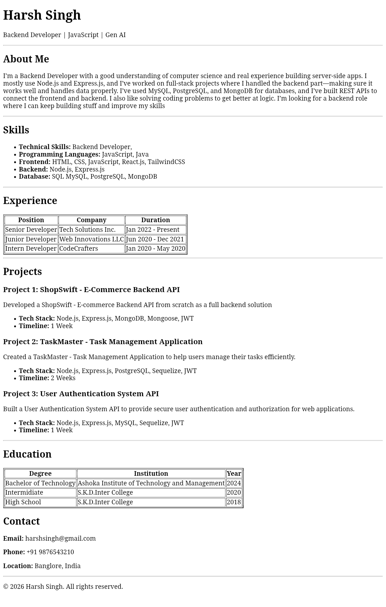

# 📄 HTML Resume Page

A simple and responsive **HTML Resume Page** built using core web technologies.  
This project showcases a clean resume layout suitable for personal portfolios, beginner frontend practice, and evaluations.

---

## ✨ Features
- 📌 Clean and structured resume layout  

---

## 🛠️ Tech Stack
- **HTML5** – Structure  

---

## 📂 Project Structure

HTML-Resume-Page-Assignment/
│── index.html        # Main resume page
│── README.md

---

## ⚙️ Setup Instructions

### 1️⃣ Clone the Repository
```bash
git clone https://github.com/harshsinghh26/HTML-Resume-Page-Assignment.git

cd HTML-Resume-Page-Assignment

```

## 🖼️ Screenshots

